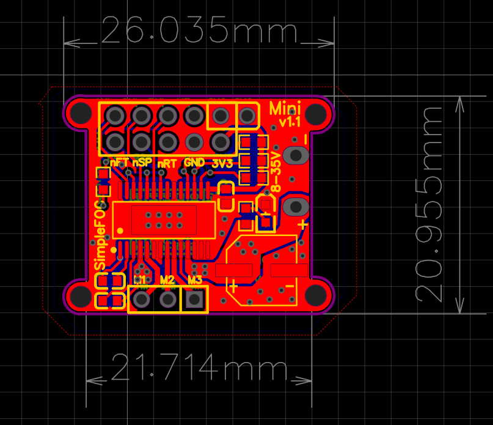
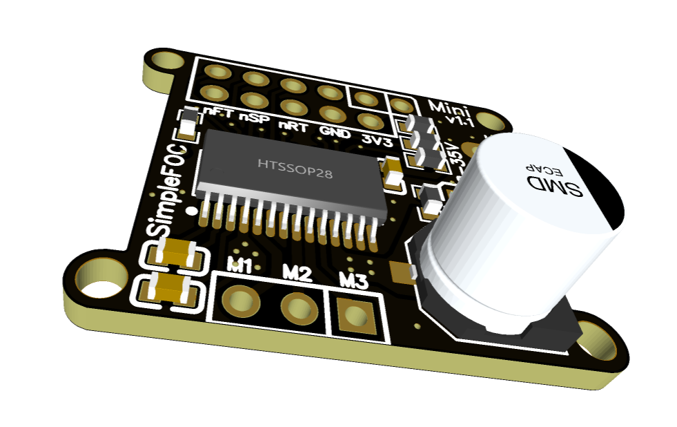
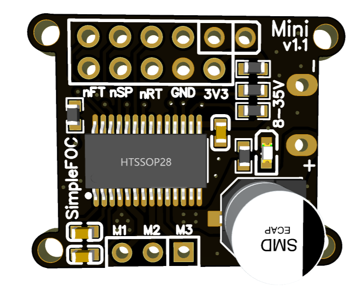
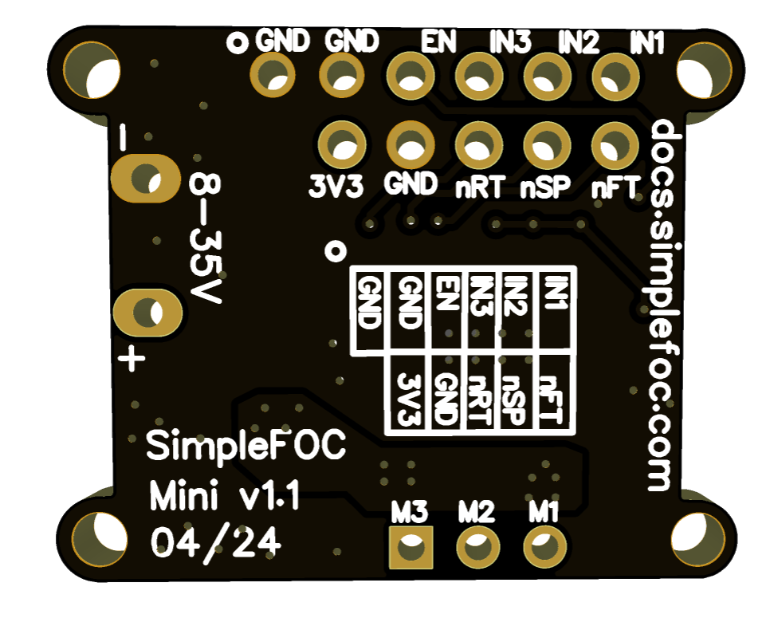

# SimpleFOCMini v1.1

## Features
- DRV8313 based - [datasheet](https://www.ti.com/lit/ds/symlink/drv8313.pdf?ts=1650461862269&ref_url=https%253A%252F%252Fwww.google.com%252F)
  - Power supply: 8-24V
  - Max current: 2.5A per phase
  - Onboard 3.3V LDO
- Small size 26x20 mm
- Fully compatible with the *Simple**FOC**library*
- Fully open-source: [EasyEDA link](https://easyeda.com/the.skuric/simplefocmini)
- Low-cost: JLCPCB production cost ~3-5€
- Available in the [shop](https://www.simplefoc.com/shop) 10-15€ 

## Docs

See the documentation in the [SimpleFOC documentation](https://docs.simplefoc.com/simplefocmini) page. 
- The docs explain how to start with the SimpleFOCMini board and how to use it with the SimpleFOC library. 
- They also describe how you can order it directly from the JLCPCB.

## Release log

Release | Date | Description
--- | --- | ---
v1.1 | 2024-04 | A quick iteration with a few changes:  - aligned motor output header with the input header so that it can be stacked in the protoboard - changed the order of the IN1,IN2,IN3 and EN: to be easier to use with arduino UNO, nucleos, but also with qtpy...
v1.0 | 2022-04 | Initial release

## Size comparison

